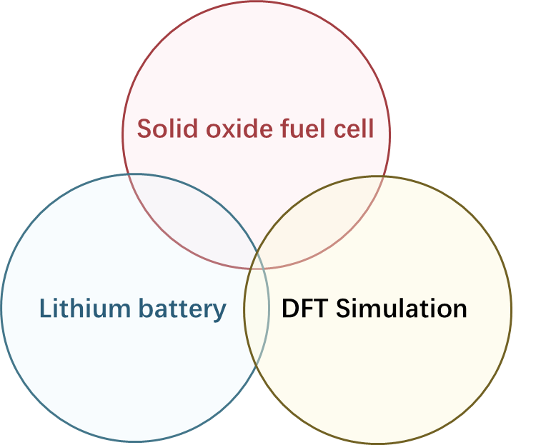
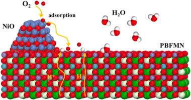
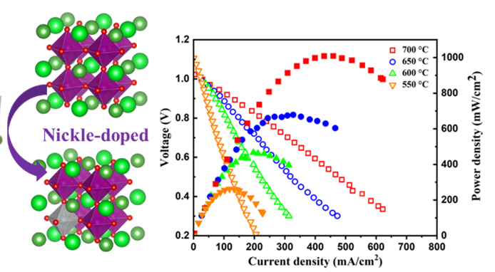
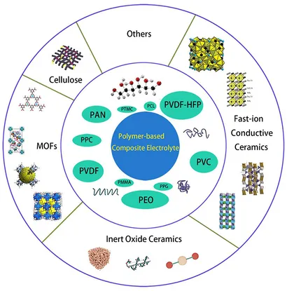
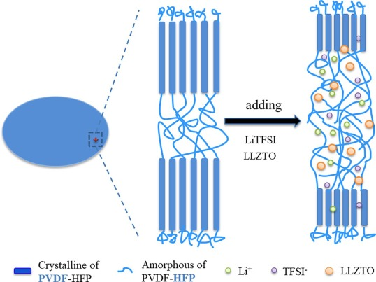

I am a Ph.D. candidate at Aalto University, working under the mentorship of Prof. Yongdan Li. I got a master's degree from Harbin Institute of Technology. My research interests focus on Solid Oxide Fuel Cells, Density Functional Theory (DFT) simulations, and Lithium-ion Batteries. Throughout my academic career, I have been honored with several prestigious awards and scholarships, including the Chinese Government Scholarship, Outstanding Graduate Award from Harbin Institute of Technology, Aalto University Incentive Scholarship, and the National Inspirational Scholarship.  

I have had the privilege of collaborating on research projects with various esteemed institutions, including Harbin Institute of Technology, Tianjin University, and Shandong University of Technology.

Research Interests
======
<table style="border-collapse: collapse; border: none;">
  <tr style="border: none;">
    <td style="border: none; padding-right: 10px;">
      
    </td>
    <td style="border: none; vertical-align: top;">
      

        My research interests focus on Solid Oxide Fuel Cells, Density Functional Theory (DFT) simulations, and Lithium-ion Batteries.
      

      

        <strong>1. Solid Oxide Fuel Cell Thin Film Electrolyte Preparation and Perovskite Cathode Material Research:</strong>
        My research focuses on the fabrication of thin film electrolytes for solid oxide fuel cells and the investigation of perovskite-based cathode materials to enhance their performance and stability.
      

      

        <strong>2. Lithium-Ion Fuel Cell Solid Electrolyte Research:</strong>
        I explore the development and optimization of solid electrolytes for lithium-ion fuel cells, aiming to improve their ionic conductivity and overall efficiency.
      

      

        <strong>3. High-Temperature Lithium-Air Battery Research:</strong>
        My work involves studying high-temperature lithium-air batteries, focusing on their electrochemical properties and potential applications for high-energy storage solutions.
      

      

        <strong>4. DFT Simulation Mechanism Research for Lithium-Ion and Fuel Cells:</strong>
        I employ Density Functional Theory (DFT) simulations to investigate the mechanisms and material interactions within lithium-ion and fuel cells, providing insights for better design and performance enhancement.
      

    </td>
  </tr>
</table>

Awards
======
- [2020-2024] Chinese Government Scholarship
- [Dec. 2023] Aalto Incentive Scholarship
- [July. 2020] Outstanding Graduate Award（Top 5%）
- [2014-2016] the National Inspirational Scholarship

Publication
------
<table style="border-collapse: collapse; border: none;">
  <tr style="border: none;">
    <td style="border: none; padding-right: 10px;">
      
    </td>
    <td style="border: none; vertical-align: top;">
      

        <a href="https://www.sciencedirect.com/science/article/pii/S0378775324005433" style="color: purple; text-decoration: none;">
          A dual modification strategy of highly active catalytic cathode for proton-conducting solid oxide fuel cell with Ni-doped PrBaFe1.9Mo0.1O6-δ
        </a>
      

      

        Penghui Yao, Jian Zhang, Qianyuan Qiu, Yicheng Zhao, Fangyong Yu, Yongdan Li
      

    </td>
  </tr>
</table>

<table style="border-collapse: collapse; border: none;">
  <tr style="border: none;">
    <td style="border: none; padding-right: 10px;">
      
    </td>
    <td style="border: none; vertical-align: top;">
      

        <a href="https://www.sciencedirect.com/science/article/pii/S0272884223034478" style="color: purple; text-decoration: none;">
          Design of a perovskite oxide cathode for a protonic ceramic fuel cell
        </a>
      

      

        Penghui Yao, Jian Zhang, Qianyuan Qiu, Gen Li, Yicheng Zhao, Fangyong Yu, Yongdan Li
      

    </td>
  </tr>
</table>

<table style="border-collapse: collapse; border: none;">
  <tr style="border: none;">
    <td style="border: none; padding-right: 10px;">
      
    </td>
    <td style="border: none; vertical-align: top;">
      

        <a href="https://www.frontiersin.org/journals/chemistry/articles/10.3389/fchem.2019.00522/full" style="color: purple; text-decoration: none;">
          Review on polymer-based composite electrolytes for lithium batteries
        </a>
      

      

        ESI highly cited paper（2019-2023）
      

      

        Penghui Yao, Haobin Yu, Zhiyu Ding, Yanchen Liu, Juan Lu, Marino Lavorgna, Junwei Wu, Xingjun Liu
      

    </td>
  </tr>
</table>

<table style="border-collapse: collapse; border: none;">
  <tr style="border: none;">
    <td style="border: none; padding-right: 10px;">
      
    </td>
    <td style="border: none; vertical-align: top;">
      

        <a href="https://www.sciencedirect.com/science/article/pii/S1385894719303870" style="color: purple; text-decoration: none;">
          Hybridizing poly(vinylidene fluoride-co-hexafluoropropylene) with Li6.5La3Zr1.5Ta0.5O12 as a lithium-ion electrolyte for solid state lithium metal batteries
        </a>
      

      

        Juan Lu, Yanchen Liu, Penghui Yao <strong>(Co-first author)</strong>, Zhiyu Ding, Qiming Tang, Junwei Wu, Ziran Ye, Kevin Huang, Xingjun Liu
      

    </td>
  </tr>
</table>

Talk
------

## Presentations

<table style="border-collapse: collapse; border: none; width: 100%;">
  <tr style="border: none;">
    <td style="border: none; vertical-align: top;">
      

        The Third Workshop on Catalytic Reactions with Ion Transfer through Interfaces (ITICAT2024)
      

      

        <em>July 10 - 12, 2024 | Finland</em> 
        <strong>Oral Presentation:</strong> 
        <em>Title:</em> <em>"Design of a Perovskite Oxide Cathode for a Proton-Conducting Solid Oxide Fuel Cell"</em>
      

    </td>
  </tr>
</table>
<table style="border-collapse: collapse; border: none; width: 100%;">
  <tr style="border: none;">
    <td style="border: none; vertical-align: top;">
      

        EuropaCat
      

      

        <em>August 27 – September 1, 2023 | Prague</em> 
        <strong>Oral Presentation:</strong> 
        <em>Title:</em> <em>"Perovskite Oxide Cathode for Lithium Oxygen (Li-O2) Battery"</em>
      

    </td>
  </tr>
</table>
<table style="border-collapse: collapse; border: none; width: 100%;">
  <tr style="border: none;">
    <td style="border: none; vertical-align: top;">
      

        China Energy Research Association Fuel Cell Seminar
      

      

        <em>May 2023 | China</em> 
        <strong>Oral Presentation:</strong> 
        <em>Title:</em> <em>"Design of a Perovskite Oxide Cathode for a Proton-Conducting Solid Oxide Fuel Cell"</em>
      

    </td>
  </tr>
</table>

Collaboration
------

